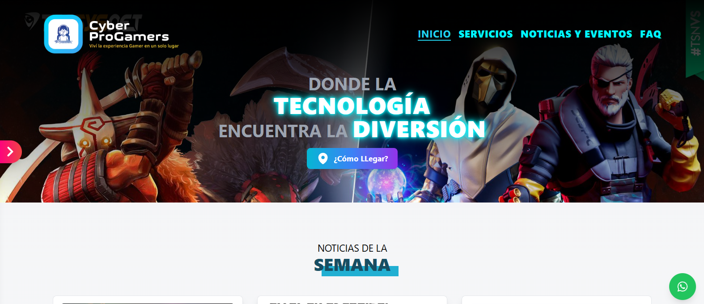

<!-- Banner -->


# 👋 ¡Bienvenido a Mi App para el Ciber!

## 🚀 Proyecto: **App para el Ciber**

Esta es una aplicación web moderna y completa diseñada para gestionar y promocionar los servicios de un cibercafé. La aplicación incluye una interfaz pública con información sobre servicios, noticias, eventos, preguntas frecuentes (FAQ) y una galería de imágenes. Además, cuenta con un área administrativa para gestionar noticias y la galería, accesible únicamente mediante autenticación.

## 🛠️ Tecnologías Utilizadas

- **Frontend**:
  - **React**: Librería para construir interfaces de usuario.
  - **React Router DOM**: Para la navegación entre las diferentes páginas.
  - **Tailwind CSS**: Framework de CSS para estilizar la aplicación.
  - **Headless UI**: Componentes accesibles y altamente personalizables.
  - **Heroicons**: Conjunto de íconos SVG.
  - **React Icons**: Biblioteca de íconos.
  - **Swiper**: Para carruseles y deslizadores interactivos.
  - **React Image Gallery**: Manejo de galerías de imágenes.
  - **React Toastify**: Notificaciones en tiempo real.
  - **React Loading Skeleton**: Indicadores de carga estilizados.
  - **Framer Motion**: Animaciones fluidas.
  - **React Hook Form**: Manejo eficiente de formularios.
  - **Axios**: Cliente HTTP para realizar peticiones.
  - **Zod**: Validación de datos.
  - **TypeScript**: Tipado estático para un desarrollo más robusto.

- **Backend y Servicios**:
  - **Firebase Authentication**: Para autenticación y manejo de usuarios.
  - **Firebase Database**: Base de datos para almacenar información.
  - **Cloudinary**: Almacenamiento de imágenes.
  - **EmailJS**: Envío de correos electrónicos.
  - **WhatsApp API**: Contacto rápido mediante WhatsApp.

## 📝 Funcionalidades Principales

### 🌐 Interfaz Pública
- **Página de Inicio**: Información sobre el cibercafé.
- **Servicios**: Lista detallada de servicios ofrecidos.
- **Noticias y Eventos**: Actualizaciones y próximos eventos.
- **FAQ**: Preguntas frecuentes para ayudar a los usuarios.
- **Galería de Imágenes**: Imágenes del ciber almacenadas en Cloudinary.

### 🔒 Área Administrativa
- **Autenticación**: Inicio de sesión mediante Firebase Authentication.
- **Gestión de Noticias**: Crear, editar y eliminar noticias.
- **Gestión de Galería**: Subir imágenes a Cloudinary y administrar URLs en Firebase.

### 📩 Comunicación
- **Envío de Correos**: Integración con EmailJS para contacto.
- **WhatsApp**: Enlace directo para contacto rápido.

## 🎥 Demostración

Puedes ver una demostración del proyecto en [este enlace de YouTube](#).

## 📂 Estructura del Proyecto

```bash
src/
├── components/       # Componentes reutilizables (galerías, formularios, etc.)
├── helpers/          # Funciones utilitarias
├── layouts/          # Layouts principales
├── pages/            # Páginas de la aplicación (Inicio, Servicios, FAQ, etc.)
├── services/         # Configuración de Firebase, Cloudinary y EmailJS
├── store/            # Configuración de estado global
├── types/            # Definiciones de tipos para TypeScript
└── views/            # Vistas de la aplicación pública y administrativa
```

## 🚀 Cómo Empezar
1. Clona el repositorio:

```bash
git clone https://github.com/RodrigoLoboDev/REST_API_FRONTEND-PRODUCTS
```
2. Instala las dependencias:

```bash
npm install
```

3. Inicia el servidor de desarrollo:

```bash
npm run dev
```

## 📸 Capturas de Pantalla


## 🤝 Contribuciones
Las contribuciones son bienvenidas. Si tienes ideas para mejorar el proyecto, no dudes en abrir un issue o hacer un pull request.

## 📧 Contacto
- Email: rolobo2812@gmail.com
- LinkedIn: [Jesús Luis Rodrigo Lobo](https://www.linkedin.com/in/jes%C3%BAs-luis-rodrigo-lobo-6594a81b4/)
- GitHub: [RodrigoLoboDev](https://github.com/RodrigoLoboDev)

#### ⭐️ Si te gusta lo que hago, no dudes en seguirme y contribuir a mis proyectos. ⭐️